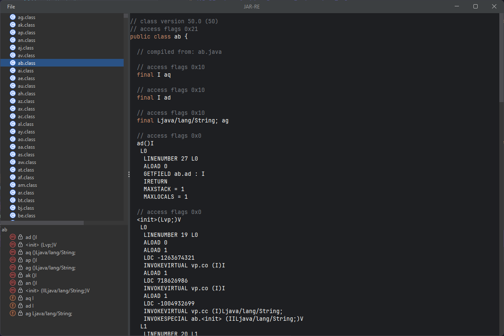

# JAR-RE: Java Archive Reverse Engineering Tool

JAR-RE is a specialized tool designed to simplify the process of reverse engineering Java archives, with a particular focus on Old School RuneScape (OSRS) gamepack deobfuscation. While primarily built to enhance OSRS reverse engineering workflows, JAR-RE can be used to analyze and deobfuscate any JAR file.

## Screenshot

*Caption: JAR-RE main interface showing the tree view, content panel, and structure panel.*

## Features

- Java archive analysis and deobfuscation
- Tree view of classes within a JAR file
- Content panel for viewing and editing class code
- Structure panel for navigating methods and fields
- EventBus system for decoupled event handling
- Modern UI using FlatLaf for an enhanced user experience

## Current Development Status

JAR-RE is under active development. While it's already functional for basic JAR analysis, there are several planned enhancements to make it even more powerful and user-friendly.

### TODO List

- [ ] Enhance the IDE with features like line numbers
- [ ] Make the structure panel toggleable
- [ ] Implement scrolling to methods/fields when selected in the structure panel
- [ ] Add support for analyzing multiple JAR files simultaneously
- [ ] Develop a comprehensive refactoring tool
- [ ] Implement save functionality for modified classes
- [ ] Introduce custom theming options
- [ ] Create a custom script section for executing code on ClassNode, MethodNode, or FieldNodes

## Getting Started

...

## Contributing

JAR-RE is an open-source project, and contributions are welcome! If you're interested in helping to improve the tool, please feel free to submit pull requests or open issues for bugs and feature requests.

## License

MIT License

Copyright (c) 2024 BoritoPalito

Permission is hereby granted, free of charge, to any person obtaining a copy
of this software and associated documentation files (the "Software"), to deal
in the Software without restriction, including without limitation the rights
to use, copy, modify, merge, publish, distribute, sublicense, and/or sell
copies of the Software, and to permit persons to whom the Software is
furnished to do so, subject to the following conditions:

The above copyright notice and this permission notice shall be included in all
copies or substantial portions of the Software.

THE SOFTWARE IS PROVIDED "AS IS", WITHOUT WARRANTY OF ANY KIND, EXPRESS OR
IMPLIED, INCLUDING BUT NOT LIMITED TO THE WARRANTIES OF MERCHANTABILITY,
FITNESS FOR A PARTICULAR PURPOSE AND NONINFRINGEMENT. IN NO EVENT SHALL THE
AUTHORS OR COPYRIGHT HOLDERS BE LIABLE FOR ANY CLAIM, DAMAGES OR OTHER
LIABILITY, WHETHER IN AN ACTION OF CONTRACT, TORT OR OTHERWISE, ARISING FROM,
OUT OF OR IN CONNECTION WITH THE SOFTWARE OR THE USE OR OTHER DEALINGS IN THE
SOFTWARE.

## Disclaimer

JAR-RE is intended for educational and research purposes only. Users are responsible for ensuring they have the necessary rights and permissions before analyzing or modifying any JAR files.

---

JAR-RE: Making Java reverse engineering a breeze, one class at a time!